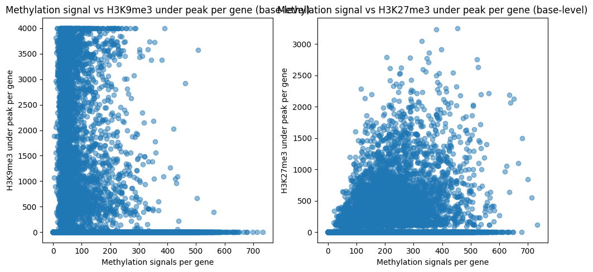
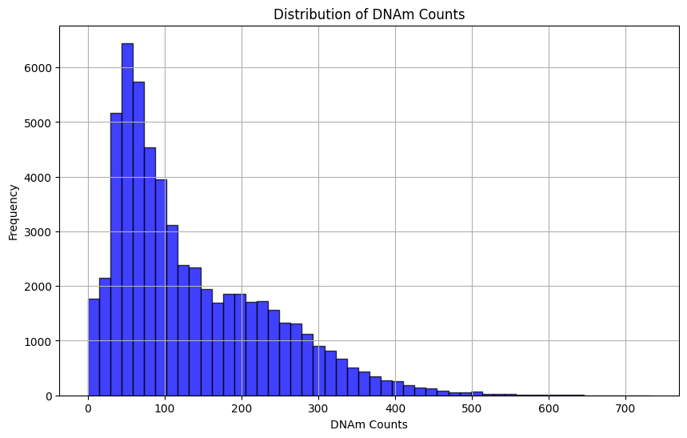

# Results

## Exploratory Analysis
- Plotting expected counts, DNAm and histone peaks against one another 
- Adjusted gene annotations to +-2KB around TSS

## Initial modelling
Utilising a 58780, 4000, 3 matrix created from the data
- 58780 genes
- 4000 nucleotides per gene (+- 2KB around TSS)
- 3 modification types (DNAm, K9, K27)

This 3D matrix is then converted into 58780 1-dimensional 12000 shape arrays (to be fed to ML models as single instances)
- 12000 is derived by concatenating the three 4000 long modification data into a single row of 12000

Stage 1: Use regression (tree-based) models to predict expected count (using mean squared error)

| Model Type  | MSE | RMSE |
| ------------- | ------------- | ------------- |
| Random Forest  | 6106315.026  | |
| XGBoost  | 8576452.711  | |
| Gradient Boosting Regressor  | 6577097.108 | |
| LightGBM Regressor  | 5931371.431 | |
| CatBoost Regressor  | 6610849.514  | |
| Support Vector Regressor  | 5542019.612 | |
| AdaBoost Regressor | 1527278184.653 | |

Comments:
- SVR saw best performance (potentially due to high-dimensional data)
- Followed by LightGBM (good for [large datasets](https://www.kaggle.com/code/prashant111/lightgbm-classifier-in-python))
- Followed by Random Forest 

Default settings utilised:
- Random forest: [MSE](https://scikit-learn.org/stable/modules/generated/sklearn.ensemble.RandomForestRegressor.html)
- XGBRegressor: [MSE](https://xgboost.readthedocs.io/en/stable/parameter.html)
- LightGBM: [MSE](https://lightgbm.readthedocs.io/en/latest/Parameters.html)
- SVM: [Epsilon Insensitive Loss](https://scikit-learn.org/stable/modules/generated/sklearn.svm.SVR.html)

Stage 2: Use classification (tree-based) models to predict 0 expected count or non-0 expected count (using precision, recall and F1)

| Model Type  | Accuracy | Precision | Recall | F1 |
| ------------- | ------------- | ------------- | ------------- | ------------- |
| Random Forest Classifier  | 0.7509 | 0.6692 | 0.6569 | 0.6630 |
| XGBoost  | 0.7574  | 0.7261  | 0.5616  | 0.6333  |
| LightGBM  | 0.7666  | 0.7317  | 0.5912  | 0.6540  |
| Support Vector Machine  | 0.7726 | 0.7798 | 0.5442 | 0.6411 |

Comments: 
- More balanced prediciton of positive and negative classes for RF, followed by LightGBM with the second highest F1 score
- SVM saw the highest accuracy, with decent ability to predict positive class (non-silent genes) but poorer ability to predict negative class
- The same applies for XGBoost and LightGBM (although LightGBM is slightly better at predicting the negative class)
- potentially an ensemble model could see more accurate results?

Next steps: 
- no need to standardise counts for regressor (would be more relevant if comparing between genes - making the assumption that measurement of noise is fair across the dataset)
- Would be helpful to see plot of expression against genome (expected count on one axis)
- Would be good to try a different threshold (slightly higher than 0 - use above plot to see where peaks are - will ultimately be an arbitrary choice but we assume that some thresholds would be better than others)

 

## Plotting expression (to select a threshold for classification)

- selected 1000 genes and plotted expected counts against the index of that gene (and altered the ceiling to allow for a closer look at the lower level expression without altering the appearance of the visualisation, such as through the use of log)
- Will try thresholds 1, 3, and 5 and compare performance on the above default classification models

## Comparison of thresholds 

*Threshold: 1*

| Model Type  | Accuracy | Precision | Recall | F1 |
| ------------- | ------------- | ------------- | ------------- | ------------- |
| Random Forest Classifier  | 0.7815 | 0.6905 | 0.6229 | 0.6549 |
| XGBoost  | 0.7774  | 0.7165  | 0.5482  | 0.6212  |
| LightGBM  | 0.7908  | 0.7297  | 0.5904  | 0.6527  |
| Support Vector Machine  | 0.7928 | 0.7617 | 0.5496 | 0.6385 |

 

*Threshold: 3*

| Model Type  | Accuracy | Precision | Recall | F1 |
| ------------- | ------------- | ------------- | ------------- | ------------- |
| Random Forest Classifier  | 0.8053 | 0.7232 | 0.5498 | 0.6247 |
| XGBoost  | 0.8015  | 0.7117  | 0.5492  | 0.6200  |
| LightGBM  | 0.8095  | 0.7215  | 0.5763  | 0.6408  |
| Support Vector Machine  | 0.8119 | 0.7400 | 0.5579 | 0.6362 |

 

*Threshold: 5*

| Model Type  | Accuracy | Precision | Recall | F1 |
| ------------- | ------------- | ------------- | ------------- | ------------- |
| Random Forest Classifier  | 0.8037 | 0.7203 | 0.4767 | 0.5737 |
| XGBoost  | 0.8093  | 0.7077  | 0.5313  | 0.6069  |
| LightGBM  | 0.8187  | 0.7171  | 0.5712  | 0.6359  |
| Support Vector Machine  | 0.8214 | 0.7307 | 0.5629 | 0.6359 |

Notes:
- Generally, it seems that increasing the threshold assists the model in predicting the positive class (non-silent) and makes it harder to predict the negative class (silent genes). Whilst accuracy and precision increase, recall decreases. Using the F1 harmonic mean may be more useful as a indicator of success considering our goals of classifying silent genes (as opposed to accuracy).
- Max F1 reached = RF classifier witha  threshold of 0 (0.66)
- As we increase the threshold, we see a drop across all models in recall and F1, however, the drop for the LightGBM model is more slight than the others
- SVM performs best in classifying positive class but poorly in classifying negative class

It should be noted that the size of the classes is unbalanced with a greater number of silent genes than non-silent. The genes with low expression counts are close to our threshold and difficult to classify. To explore the impact of this, we will undersample the silent (negative) class.

Class sizes:

| Threshold | Silent (negative class) | Non-silent (positive class)|
| ------------- | ------------- | ------------- |
| 0 | 36642 | 22138 |
| 1  | 39025  | 19755  |
| 3  | 41265  | 17515  |
| 5 | 42364 | 16416 |

 

Ensemble Model (SVM + LGBM): 
- Was curious to see the impact of combining such models (SVM best at classifying positive class, LGBM most stable when classifying LGBM)
- Ensemble model combining lightgbm and SVM (with soft voting)
- threshold = 0
- Unbalanced classes
- Based on the below results, the combination of these models didn't provide a significant increase to F1 (as compared to the standalone LGBM or SVM F1 values)

| Accuracy | Precision | Recall | F1 |
| ------------- | ------------- | ------------- | ------------- |
| 0.7734 | 0.7567 | 0.5787 | 0.6558 |

## Repeating models with balanced classes

Due to the imbalance between silent and non-silent genes, we will repeat the classification task using a threshold of 0 and undersampling the silent class. Both classes are now the same sized (matched to the size of the smallest class = 22138 & 22138)

| Model Type  | Accuracy | Precision | Recall | F1 |
| ------------- | ------------- | ------------- | ------------- | ------------- |
| Random Forest Classifier  | 0.7185 | 0.7164 | 0.7260 | 0.7211 |
| XGBoost  | 0.7243 | 0.7617 | 0.6550 | 0.7043 |
| LightGBM  | 0.7293 | 0.7524 | 0.6858 | 0.7176 |
| Support Vector Machine  | 0.7377 | 0.8029 | 0.6320 | 0.7072 |

Notes: 
- F1 scores have increased considerably (around 5% each)
- Accuracy has decreased but was likely inflated previously due to the imbalance of class sizes
- Precision and recall have both increased
- Using the same number of rows for silenced and unsilenced
- SVM best for precision but still not great at classifying silent genes

## Modelling with DNAm as output

To explore the interplay between histone modifications, expression and DNA methylation, we will model using expression and histone modifications as our input and DNA methylation as our output. To begin with more simple and interpretable modelling, we will start with similar ML models. 

NOTE: predicting DNAm is not as straightforward as expression (with a count value that can be classified as silent or non-silent). To begin, I attempted a multioutput model (predicting binary output for all 4000 positions) but am unsure whether this is appropriate. Regardless, I will be meeting with HPC team to assist with running a script using distributed computation. 

For a simpler approach, we predict the count of methylated bases (x/4000).

The distribution of the DNAm counts is shown below: 

*Regression Results*

| Model | MAE | MSE | R^2 |
| ------------- | ------------- | ------------- | ------------- |
| Random Forest | 62.3022 | 7097.7616 | 0.3122 |
| XGBoost | 60.4960 | 6689.7580 | 0.3518 | 
| LightGBM | 60.1549 | 6581.1190 | 0.3623 |
| SVM | 68.9159 | 9374.4317 | 0.0916 | 

To assist in the interpretation of these results, actual vs predicted graphs are provided below:

| Random Forest | XGBoost | LightGBM | SVM |
|---------|---------|---------|---------|
|  |  |  |  |

Notes: 
- LightGBM sees lowest error
- Distribution of the DNAm counts is skewed - should I be considering transforming count by taking the log?
- Based on actual vs predicted plots, seems to sit consistently around 100 - 300 for predicted values. Could this be improved with transformations?
- Potentially a combination of skewed distribution for DNAm counts and inputs on different scales - 8000 binary + 1 expression count value

*Replotting with log and sqrt to explore whether transforming variables would improve outcomes*
| Random Forest Log | XGBoost Log | LightGBM Log | SVM Log |
|---------|---------|---------|---------|
|  |  |  |  |

| Random Forest Sqrt | XGBoost Sqrt | LightGBM Sqrt | SVM Sqrt |
|---------|---------|---------|---------|
|  |  |  |  |

Notes: 
- No improvement through use of transformations
- Should I explore this further?

## Exploring the use of neural networks

### Simple (single) fully connected layer

Using a single fully connected linear layer and cross entropy loss. 
Using: 
- 0 threshold
- Linear layer
- Balanced and unbalanced class (as listed)
- Criterion = nn.CrossEntropyLoss()
- Optimizer = optim.Adam(model.parameters(), lr=0.001)
- Epochs = 10
- batch norm for regularisation (only in stated table)

*Balanced classes*

| Accuracy | Precision | Recall | F1 |
| ------------- | ------------- | ------------- | ------------- |
| 0.5854 | 0.5528 | 0.9050 | 0.6863 |

 

*Unbalanced classes*

| Accuracy | Precision | Recall | F1 |
| ------------- | ------------- | ------------- | ------------- |
| 0.6857 | 0.5798 | 0.5720 | 0.5759 |

 

*Balanced classes & Batch Normaslisation* - Note: Realised I normalised before passing through the layer so basically just normalised the input data rather than the layer output

| Accuracy | Precision | Recall | F1 |
| ------------- | ------------- | ------------- | ------------- |
| 0.7245 | 0.7622 | 0.6547 | 0.7044 |

Notes:
- Achieving very high recall with balanced classes (great at classifying silent genes but poorer performance classifying non-silent genes)
    - Opposite effect of using the simpler ML models
- Including batch normalisation balances precision and recall (+ highest F1 score)
- F1 score is comparable to the balanced simpler ML models (RF, LGBM, XGB, SVM) and is only utiltising a single linear layer 
    - Promising results considering its simplicity

### Multi-layer NN (with 2 linear hidden layers + batchNorm + ReLU)

 

*Balanced classes & Batch Normaslisation* - Note: normalisation applied to hidden layer output before activation

| Accuracy | Precision | Recall | F1 |
| ------------- | ------------- | ------------- | ------------- |
| 0.6233 | 0.5801 | 0.9 | 0.7055 |

Note: 
- Class prediction success is now imbalanced again (potentially due to the removal of initial data normalisatin)
- Despite this disparity betwen precision and recall, F1 just surpasses the normalised input single layer model (likely due to activation function and extra layer)
- Out-performed by RF, LGBM and SVM (based on F1)

### Multi-layer NN (with 3 linear hidden layers + batchNorm +  ReLU)

 

*Balanced classes & Batch Normaslisation* - Note: normalisation applied to hidden layer output before activation

| Accuracy | Precision | Recall | F1 |
| ------------- | ------------- | ------------- | ------------- |
| 0.6332 | 0.5919 | 0.8646 | 0.7027 |

Notes:
- Trade-off with slight increase in precision and decrease in recall
- Overall, worse performance than 2 layer model (based on F1)

### Switching to Binary Cross Entropy Loss
### Multi-layer NN (with 2 linear hidden layers [1000, 500] + dropout(0.5) +  ReLU)

 

*Balanced classes & Drop-out* - Note: dropout applied to first hidden layer before ReLU

| Data set | Accuracy | Precision | Recall | F1 |
| ------------- | ------------- | ------------- | ------------- | ------------- |
| Train | 0.9481 | 0.9865 | 0.9085 | 0.9459 |
| Test | 0.7136 | 0.7497 | 0.6437 | 0.6927 |

Notes:
- Generalises poorly to new data
- Will introduce stricter regularisation and less neurons

### Multi-layer NN (with 3 linear hidden layers [1000, 500] + dropout(0.5) + weight decay(1e-4) +  ReLU)

 

*Balanced classes, Drop-out & Weight Decay (L2)* 

| Data set | Accuracy | Precision | Recall | F1 |
| ------------- | ------------- | ------------- | ------------- | ------------- |
| Train | 0.9184 | 0.9681 | 0.8652 | 0.9138 |
| Test | 0.7184 | 0.7617 | 0.6378 | 0.6943 |

Notes:
- Slight improvement to generalisation
- Will try L1 regularisation instead of L2

 

*Balanced classes, Drop-out & L1* 

| Data set | Accuracy | Precision | Recall | F1 |
| ------------- | ------------- | ------------- | ------------- | ------------- |
| Train | 0.8763 | 0.9371 | 0.8065 | 0.8491 |
| Test | 0.7136 | 0.7508 | 0.6419 | 0.6921 |

Notes:
- Similar if not slightly worse than L2
- Will return to L2 and run for more iterations to see if that helps

 

*Balanced classes, Drop-out & L2 - increased iterations* 
- iterate for 100 epochs

| Data set | Accuracy | Precision | Recall | F1 |
| ------------- | ------------- | ------------- | ------------- | ------------- |
| Train | 0.9237 | 0.9672 | 0.8770 | 0.9200 |
| Test | 0.7144 | 0.7401 | 0.6633 | 0.6996 |

## Restricted Boltzman Machine
Source used for code template: [Beginners Guide to Boltzmann Machine](https://blog.paperspace.com/beginners-guide-to-boltzmann-machines-pytorch/)

Questions: 
- Would we use this on all 4 data types at once? - K9, K27, DNAm, expression

Potential approach: 
- Train 2 models separately - one using data from silenced genes and the other from non-silent genes
- Find the patterns/interplay that lead to silencing and compare to non-silent
- Compare the hidden layer learned features
- Could potentially mask certain features to see impact on other mods??

Tracking: 
- Reconstruction error (can compare to see which is more predictable)
- Hidden layer activation patterns - differences in activation patterns (not sure how to best go about this)

### First attempt:
Model Overview: 
- Used a 12000 array of K9, K27 and WGBS
- Separated into two training sets - silent and non-silent
- Initialisation: Sets up the model with a visible layer (input data size), a hidden layer (latent features), weights (W), and biases for the hidden (h_bias) and visible layers (v_bias).
- Sampling Functions: Methods sample_h and sample_v are used to calculate probabilities and sample hidden and visible layer states.
- Forward Pass: The forward method simulates a round-trip through the RBM, starting from visible to hidden and back to visible.
- Contrastive Divergence: The contrastive_divergence method performs the training step using the Contrastive Divergence algorithm, iteratively refining the weights.
- Reconstruction Error: The reconstruction_error method calculates the error between the original and reconstructed visible layer to measure how well the model has learned.

*Note: classes were not balanced for this baseline

*Final Reconstruction Error - hidden layer [256] - 50 epochs*
 
| Silent Genes | Non-silent Genes |
| ------------- | ------------- |
| 1025.5759 | 1121.8776 |

- around 1000 values are wrong out of 12000? Is this the correct interpretation?

 

Notes: 
- based on this, will run for another 50 iters (100 total) to see impact on error reduction
- Silenced genes appear easier to regenerate

 

*Final Reconstruction Error  - 150 epochs*

| Silent Genes | Non-silent Genes |
| ------------- | ------------- |
| 588.2177 | 538.4178 |

- What is the correct way to balance fitting to noise vs fitting underlying trend
- how to approach masking?

#### Creating an RBM to take in all data at once (no silent/non-silent split)
*Final Reconstruction Error - over 100 iterations*
| All Genes | 
| ------------- | 
| 12922250 | 

- something not right here!

## Multi-Layer Perceptrons

### Predicting Expression

- Starting with dense layers [500, 300] and lr_scheduler

| Data set | Accuracy | Precision | Recall | F1 |
| ------------- | ------------- | ------------- | ------------- | ------------- |
| Train | 0.9428 | 0.9679 | 0.9158 | - |
| Test | 0.7086 | 0.7328 | 0.6590 | 0.6939 |

Notes:
- Noticed the validation loss increased quite a bit at the start and then plateaud after around 8 iteration
- Will introduce L2 reg and increased iters with early stopping

 

#### Expression: adding L2 (0.01) and early stopping (up to 150 iter)

| Data set | Accuracy | Precision | Recall | F1 |
| ------------- | ------------- | ------------- | ------------- | ------------- |
| Train | 0.7308 | 0.8036 | 0.6038 | - |
| Test | 0.7392 | 0.8259 | 0.6081 | 0.7005 |

Notes: 
- slight improvement
- not sure what happened here with the training data - seemed much lower
- also, over the 82 iterations used (due to early stopping) val loss started at 0.7465 and only decreased to around 0.64 - when more complex, seems to overfit but now doesn't seem to be fitting as well

### Predicting DNAm 
VECTOR REGRESSION
- Note: discussed using vector regression but wondering if I have confused myself due to our conversations around DNAm count (when we are predicting a binary value - should we be using multi-output classification approach instead?)

| Data set | Accuracy | Precision | Recall | F1 |
| ------------- | ------------- | ------------- | ------------- | ------------- |

 

MULTI-OUTPUT CLASSIFICATION

 

| Data set | Accuracy | Precision | Recall | F1 |
| ------------- | ------------- | ------------- | ------------- | ------------- |

