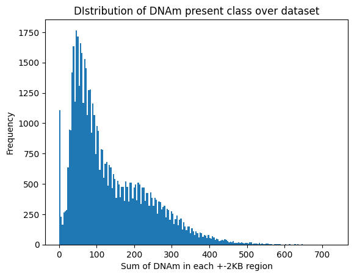

# MLP Results

## MLP to predict expression
Predicting a single binary output (silent or non-silent) based on a 12000 binary input vector (4000 DNAm, 4000 K9, 4000 K27)

General model architecture
- 2 dense layers
- experimenting with L1 and L2 regression
- experimenting with drop out layer
- assessing use of SGD vs Adam

Current issue: Model continues to overfit to the dataset - is an MLP too complex? Would be be best to return to a simpler model for this relationship and tune that?

- Starting with dense layers [500, 300] and lr_scheduler

| Data set | Accuracy | Precision | Recall | F1 |
| ------------- | ------------- | ------------- | ------------- | ------------- |
| Train | 0.9428 | 0.9679 | 0.9158 | - |
| Test | 0.7086 | 0.7328 | 0.6590 | 0.6939 |

Notes:
- Noticed the validation loss increased quite a bit at the start and then plateaud after around 8 iteration
- Will introduce L2 reg and increased iters with early stopping

<br />

#### Adding L2 (0.01) and early stopping (up to 150 iter)

| Data set | Accuracy | Precision | Recall | F1 |
| ------------- | ------------- | ------------- | ------------- | ------------- |
| Train | 0.7308 | 0.8036 | 0.6038 | - |
| Test | 0.7392 | 0.8259 | 0.6081 | 0.7005 |

Notes: 
- slight improvement
- not sure what happened here with the training data - seemed much lower
- also, over the 82 iterations used (due to early stopping) val loss started at 0.7465 and only decreased to around 0.64 - when more complex, seems to overfit but now doesn't seem to be fitting as well


#### Introducing L1 and L2 was too much regularisation

| Data set | Accuracy | Precision | Recall | F1 |
| ------------- | ------------- | ------------- | ------------- | ------------- |
| Train | 0.5007 | 0.0 | 0.0 | - |
| Test | 0.4986 | 0.0 | 0.0 | 0.0|
(480676)

- too much regularisation
- model is just randomly guessing

#### Switch to SGD(lr=0.001, momentum=0.9) - only L2 regularisation after each layer[300, 100]


| Data set | Accuracy | Precision | Recall | F1 |
| ------------- | ------------- | ------------- | ------------- | ------------- |
| Train | 0.8927 | 0.9419 | 0.8367 | - |
| Test | 0.7232 | 0.7666 | 0.6441 | 0.7001 |
(480698)

- Doesn't beat some earlier results (f1 = 0.7005)

#### Reducing neurons in layers further [100, 50]

| Data set | Accuracy | Precision | Recall | F1 |
| ------------- | ------------- | ------------- | ------------- | ------------- |
| Train | 0.8349 | 0.8864 | 0.7679 | - |
| Test | 0.7281 | 0.7762 | 0.6430 | 0.7034 |
(480703)

- Doesn't beat some earlier results (f1 = 0.7005)

#### Reducing neurons in layers further [50, 10]

| Data set | Accuracy | Precision | Recall | F1 |
| ------------- | ------------- | ------------- | ------------- | ------------- |
| Train | 0.8118  | 0.8633  | 0.7403  | - |
| Test | 0.7279 | 0.7824 | 0.6333 | 0.7000 |
(480704)

- Doesn't beat some earlier results (f1 = 0.7005)
- reducing neurons seems to be too simple now

#### Reducing neurons in layers further [10, 5] and removing one L2 layer (1 remaining)

| Data set | Accuracy | Precision | Recall | F1 |
| ------------- | ------------- | ------------- | ------------- | ------------- |
| Train | 0.8329   | 0.8839   | 0.7659   | - |
| Test | 0.7354 | 0.7862 | 0.6486 | 0.7108 |
(480705)

- Ran this whilst I was running the above models (why I continued decreasing neurons)
- Best F1 so far
- Vaidation precision and validation are still decreasing over iterations during training :(

Questions:
- am I missing any key techniques that could help here?


## MLP to predict DNAm
- Having trouble getting the model to learn the underlying patterns for this one
- Initially, I ran a model that made 0 predictions for positive class (1 = DNAm present) with a very low accuracy of 0.0140
- To investigate this, I produced a plot of the DNAm counts per sample (as seen in a previous week)



- mean DNAm positive class per sample: 134.72 (3.368% of 4000)
- median DNAm positive class per sample: 101.0 (2.525% of 4000)

To address this, I have introduced:
- `activation=None` in my final layer (as Sigmoid is applied internally within weighted cross entropy with logits)

- `tf.nn.weighted_cross_entropy_with_logits(labels=y_true, logits=y_pred, pos_weight=pos_weight)` as my loss function in my compiler
- experimenting with values for pos_weight (positive class weighting)

Note: my initial attempt to use pos_weight was set to high, leading to a recall of 1.0 and a precision of 0.0336. Following this I experimented with some other values of pos_weight to see if any could achieve reasonable results. 

#### pos_weight = 10 (0.1)

| Data set | Accuracy | Precision | Recall | F1 |
| ------------- | ------------- | ------------- | ------------- | ------------- |
| Train | 0.0   | 0.0337   | 0.0066 | - |
| Test | 0.0 | 0.0336 | 0.9997 | 0.0648 |
(480597)

- Predicting positive almost all the time


#### pos_weight = 4 (0.25)

| Data set | Accuracy | Precision | Recall | F1 |
| ------------- | ------------- | ------------- | ------------- | ------------- |
| Train | 0.0   | 0.0897 | 0.9998 | - |
| Test | 0.0123 | 0.0612 | 0.1042 | 0.0395 |
(480595)

- Super low

#### pos_weight = 3.333 (0.3)

| Data set | Accuracy | Precision | Recall | F1 |
| ------------- | ------------- | ------------- | ------------- | ------------- |
| Train | 0.0   | 0.1182 | 0.0066 | - |
| Test | 0.0140 | 0.0450 | 0.0049 | 0.0082 |
(480596)

- lower than pos_weight = 4

#### pos_weight = 2.5 (0.4)

| Data set | Accuracy | Precision | Recall | F1 |
| ------------- | ------------- | ------------- | ------------- | ------------- |
| Train | 0.0   | 0.1464 | 0.0002 | - |
| Test | 0.0140 | 0.0027 | 0.0 | 0.0 |
(480598)

- lower than pos_weight = 4
- quite hard to see whats happening here so am adding in a confusion matrix for tracking performance

Questions:
- Unsure if I'm using the best metric tracking: `precision = precision_score(y_test, y_pred, average="macro")`
    - macro = calc the metric independently for each class and then takes the average (treating all classes equally)
    - Is this appropriate given the class imbalance or am I making it harder to see what's really happening?  


#### Predicting DNAm Count (MLP regression)
```
model = tf.keras.Sequential(
    [
        tf.keras.layers.Dense(512, input_shape=(8001,), activation="relu"),
        tf.keras.layers.Dense(256, activation="relu"),
        tf.keras.layers.Dense(128, activation="relu"),
        tf.keras.layers.Dense(1, activation="linear"),  # Output layer for regression
    ]
)
```

- trained on MSE with Adam(learning_rate=0.001)
- Used early stopping (reached 15/100)

Metrics:
| Data set | MSE | 
| ------------- | ------------- |
| Train | 6757.6934   | 
| Validation | 7991.9966 | 
| Test | 7566.1483 | 
(480935)

- Training error continues to decrease
- Validation error rises over iterations
- Will repeat model with a couple variations - decrease complexity, lower learning rate, add in regularisation, normalise count data

```
model = tf.keras.Sequential(
    [
        tf.keras.layers.Dense(512, input_shape=(8001,), activation="relu", kernel_initializer='he_normal'),
        tf.keras.layers.Dropout(0.2),
        tf.keras.layers.Dense(256, activation="relu", kernel_initializer='he_normal'),
        tf.keras.layers.Dense(128, activation="relu", kernel_initializer='he_normal', kernel_regularizer=tf.keras.regularizers.L2(l2=0.01)),
        tf.keras.layers.Dense(1, activation="linear"),  # Output layer for regression
    ]
)
```
- trained on MSE with Adam(learning_rate=0.0001)
- Used early stopping (reached 14/100)

Metrics:
| Data set | MSE | 
| ------------- | ------------- |
| Train | 6891.0278   | 
| Validation | 7413.8750 | 
| Test | 7425.3827 | 
(481004)

- still poor fit but better than before


#### Predicting DNAm proportion
`y = np.sum(dnam_features, axis=1) / 4000`
- scales everything between 0 and 1 but keeps underlying distribution

```
model = tf.keras.Sequential(
    [
        tf.keras.layers.Dense(512, input_shape=(8001,), activation="relu"),
        tf.keras.layers.Dense(256, activation="relu"),
        tf.keras.layers.Dense(128, activation="relu"),
        tf.keras.layers.Dense(1, activation="linear"),  # Output layer for regression
    ]
)
```
- Adam(learning_rate=0.0001) and MSE
- Early stopping reached 24/100

Metrics:
| Data set | MSE | 
| ------------- | ------------- |
| Train | 4.2864e-04   | 
| Validation | 4.9587e-04 | 
| Test | 0.0004877 | 
(481005)

- MSE is low because much lower scale for y values (between 0 and 1)
- Very similar to outcomes for the original count data
- Comparing 7425.3827 to 0.0004877:
    - Count data scale = 0-4000
    - Proportion scale = 0-1 (achieved by dividing everything by 4000)
    - original MSE / 4000**2 = 0.0004641
    - Original scale (count) performs better than the proportion


Once again, comparing these results to those of ML models, we saw better MSE with the simpler models!
*** NEED TO CONFIRM: Run again converting expression to 0 or 1 (may have run these using expected expression value - not binary)
Should I be using binary here? Or could I use counts?

Comparison of MSE:
| Model | MSE |
| ------------- | ------------- | 
| Random Forest | 7097.7616 | 
| XGBoost | 6689.7580 | 
| LightGBM | 6581.1190 |
| MLP | 7425.3827 |

- MLP is outperformed by all ML models, with LightGBM performing most successfully (with a considerable difference). 
- Both expression (silent vs non-silent) and DNAm presence (not location specific) is better modelled by ML models, as opposed to deep learning models
- Converting LightGBM to the same scale as the proportion result, we get:
    - 6581.1190 / 4000**2 = 0.0004113

- Despite the weird plots from those models (of actual vs predicted), they performed better


## MLP to predict K9 histone modifications
- Will use the same process as DNAm
- We will use a multi-output classification MLP to perform vector regression and then use MLP to predict the count of bases under peaks within the +-2KB of TSS range

Exploring the data: 


- most samples don't have this histone modification
- less common than K27
- other than the spike for 0 and for 4000, seems to be fairly uniformly distributed - frequency of bases under K9 peaks sits between 10 and 100 for most values/counts
- mean = 129.07306907111263
- median = 0.0

#### Predicting K9 4000 vector

```
model = tf.keras.Sequential(
    [
        tf.keras.layers.Dense(
            6000,
            input_shape=(input_size,),
            activation="relu",
            kernel_initializer="he_normal",
        ),
        tf.keras.layers.Dense(
            5500,
            activation="relu",
            kernel_initializer="he_normal",
        ),
        tf.keras.layers.Dense(
            5000,
            activation="relu",
            kernel_initializer="he_normal",
        ),
        tf.keras.layers.Dense(
            4500,
            activation="relu",
            kernel_initializer="he_normal",
        ),
        tf.keras.layers.Dense(
            output_size,
            activation=None,  # using logits directly for weighted_cross_entropy_with_logits
        ),
    ]
)
```

FILL OUT
| Data set | Accuracy | Precision | Recall | F1 |
| ------------- | ------------- | ------------- | ------------- | ------------- |
| Train | 0.   | 0.   | 0. | - |
| Test | 0. | 0. | 0. | 0. |
(481025)


- 

#### Predicting K9 Count
- Sum each K9 4000 vector to get count of values

```
model = tf.keras.Sequential(
    [
        tf.keras.layers.Dense(
            128, input_shape=(8001,), activation="relu", kernel_initializer="he_normal"
        ),
        tf.keras.layers.Dropout(0.4),
        tf.keras.layers.Dense(
            64,
            activation="relu",
            kernel_initializer="he_normal",
            kernel_regularizer=tf.keras.regularizers.L1(l1=0.02),
        ),
        tf.keras.layers.Dense(1, activation="linear"),  # Output layer for regression
    ]
)
```

Metrics:
| Data set | MSE | 
| ------------- | ------------- |
| Train | 253187.7344  | 
| Validation | 372877.2812 | 
| Test | 340942.9643 | 
(481031)

- converted to proportion:
    - 340942.9643 / 4000**2 = 0.02131
    - error seems significant 


How to balance the dataset a bit more? Undersample the genes with no peaks? For both K9 and K27?

#### Comparison to ML models: predicting K9 count
- Using Random Forest Regressor, LightGBM, XGBoost and SVM

| Model | MSE |
| ------------- | ------------- | 
| Random Forest | 0 |
| XGBoost | 364188.3731 | 
| LightGBM | 338212.4002 | 
| SVM | 0 | 

- LGBM outperforms the MLP model


## MLP to predict K27 histone modifications
- Will use the same process as DNAm
- We will use a multi-output classification MLP to perform vector regression and then use MLP to predict the count of bases under peaks within the +-2KB of TSS range

Exploring the data: 


- most samples don't have this histone modification
- more common than K9
- unlike K9, this distriution is more skewed with higher frequencies of less bases
- mean = 43.509510037427695
- median = 0.0

#### Predicting K27 4000 vector

```
model = tf.keras.Sequential(
    [
        tf.keras.layers.Dense(
            6000,
            input_shape=(input_size,),
            activation="relu",
            kernel_initializer="he_normal",
        ),
        tf.keras.layers.Dense(
            5500,
            activation="relu",
            kernel_initializer="he_normal",
        ),
        tf.keras.layers.Dense(
            5000,
            activation="relu",
            kernel_initializer="he_normal",
        ),
        tf.keras.layers.Dense(
            4500,
            activation="relu",
            kernel_initializer="he_normal",
        ),
        tf.keras.layers.Dense(
            output_size,
            activation=None,  # using logits directly for weighted_cross_entropy_with_logits
        ),
    ]
)
```

FILL OUT
| Data set | Accuracy | Precision | Recall | F1 |
| ------------- | ------------- | ------------- | ------------- | ------------- |
| Train | 0.   | 0.   | 0. | - |
| Test | 0. | 0. | 0. | 0. |
(481024)

#### Predicting K27 Count
- Sum each K27 4000 vector to get count of values

```
model = tf.keras.Sequential(
    [
        tf.keras.layers.Dense(
            128, input_shape=(8001,), activation="relu", kernel_initializer="he_normal"
        ),
        tf.keras.layers.Dropout(0.4),
        tf.keras.layers.Dense(
            64,
            activation="relu",
            kernel_initializer="he_normal",
            kernel_regularizer=tf.keras.regularizers.L1(l1=0.02),
        ),
        tf.keras.layers.Dense(1, activation="linear"),  # Output layer for regression
    ]
)
```

Metrics:
| Data set | MSE | 
| ------------- | ------------- |
| Train | 22513.4844  | 
| Validation | 34780.0820 | 
| Test | 33658.4101 | 
(481030)

- converted to proportion:
    - 33658.4101 / 4000**2 = 0.0021
    - error seems significant given that the mean proportion is 43.51 / 4000 = 0.0108775
- generalises slightly better than K9


#### Comparison to ML models: predicting K9 count
- Using Random Forest Regressor, LightGBM, XGBoost and SVM

| Model | MSE |
| ------------- | ------------- | 
| Random Forest | 0 |
| XGBoost | 34807.9646 | 
| LightGBM | 32198.1695 | 
| SVM | 0 | 

- LGBM outperforms the MLP model