# Deep dive into VAE KL Loss
Investigating the VAE model's ability to sample from a normal distribution and generalise well to new samples

## Distribution of Latent Codings

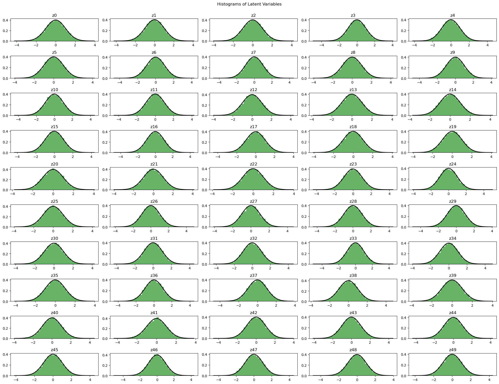
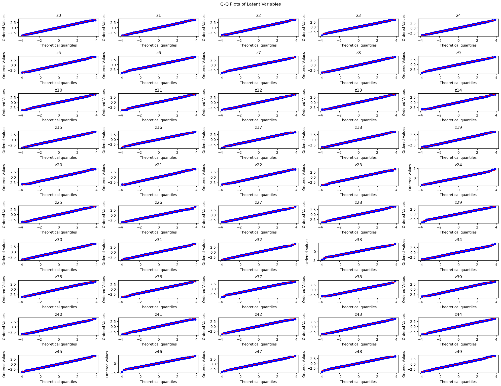

Notes:
- All follow pretty perfect normal distribution

## Investigating reconstruction (on full model)

Selected 10 samples from X_val to reconstruct and found the following:

**Predicted values for expression**
[0.35110867 0.3487356  0.3456045  0.35912287 0.3357407  0.3307529
 0.3379856  0.36754778 0.33937135 0.35138533]

Mean for expression = 0.37750935692412385

**Predicted values for the remainder of the features**

Means for X_train:
- DNAm = 0.03370221588975842
- K9 = 0.032092899370534195
- K27 = 0.010840028496087105

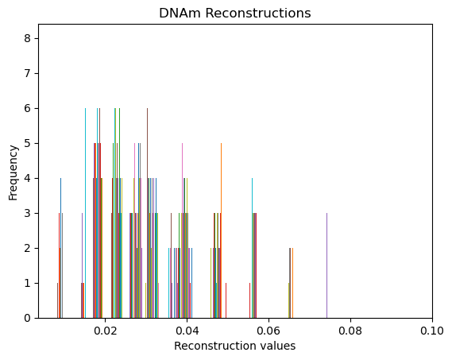
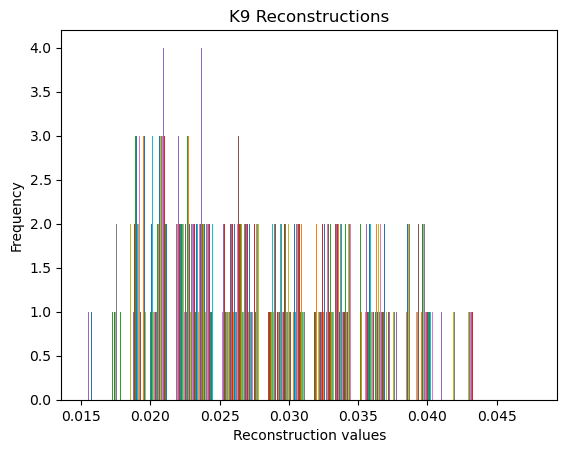
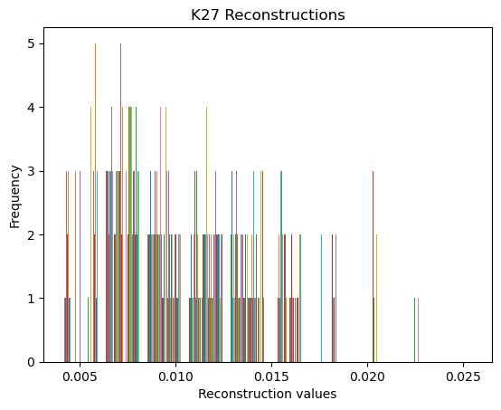


Notes: 
- model is predicting basically 0 for everything
- either the KL loss is so strong that it is overregularising the model or the recon loss is not helping the model learn at all

Potential approaches to fix:
- Reduce KL Loss (will try a more extreme example: i.e. weight of * 0.001)
- Warm up for KL Loss
- Change model architecture (increase coding size considerably, try conv layers, try batch norm and drop out in decoder, will try making both encoder and decoder more complex by adding more layers)
- Focal loss

## Investigating whether reducing KL Loss magnitude helps
I don't feel this will have a large impact but will try nonetheless. I have basically removed KL loss here so if the problem persists, it's likely due to the reconstruction not providing enough information so will explore the remaining avenues. 

**KL loss * 0.001**
KL Loss over 10 epochs: [0.0051, 0.0050, 0.0053, 0.0053, 0.0054,  0.0056,  0.0056,  0.0058, 0.0058, 0.0058]
- grows and stabilises at 0.0058

**loss plot - learns reconstruction loss better due to lack of regularisation**

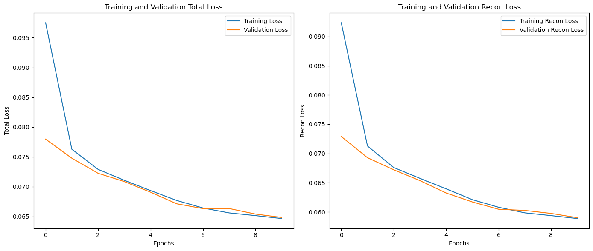

Latent variable distributions:
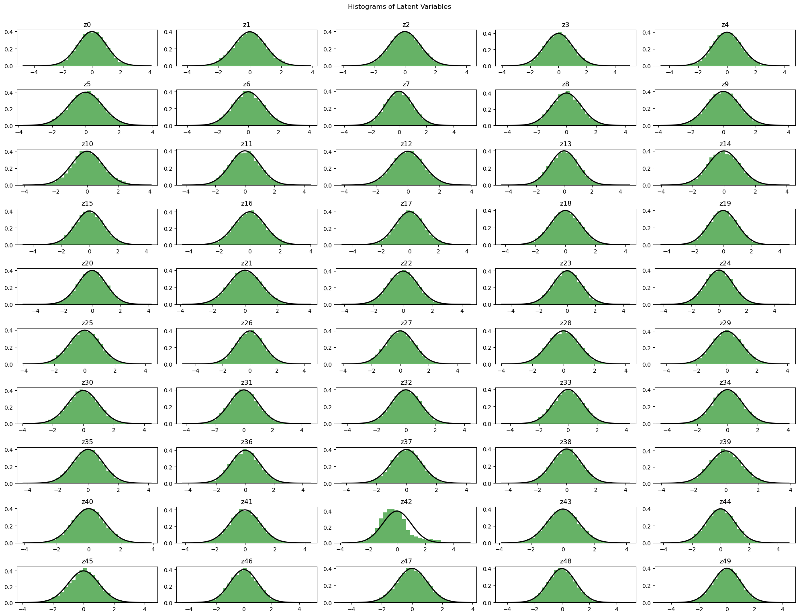


Reconstructions for expression:

[0.41321397 0.206115   0.17422764 0.29925677 0.26701182 0.5845311
 0.5104049  0.4731206  0.16559449 0.21682742]

 - more variance now

Means for X_train:
- DNAm = 0.03370221588975842
- K9 = 0.032092899370534195
- K27 = 0.010840028496087105

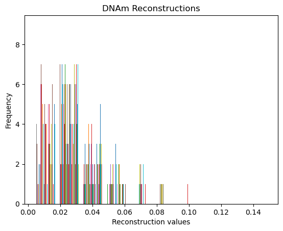
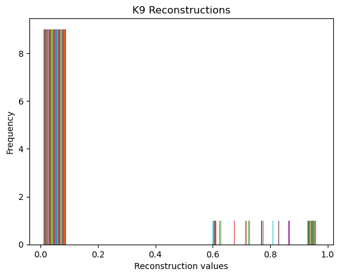
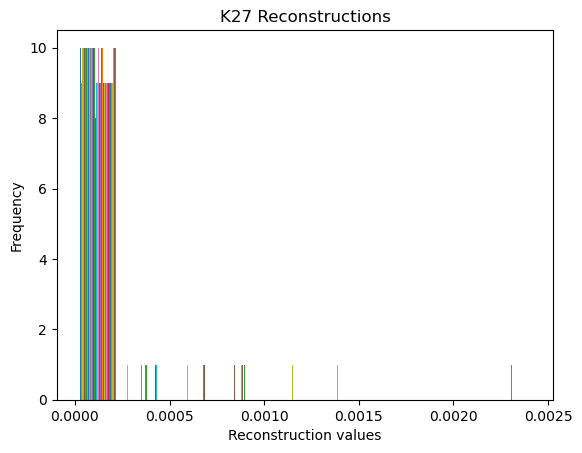

Notes:
- some improvement
- model now at least doesn't just predict the mean everytime but is still prone to output values close to zero

## Investigating whether Focal Loss helps
```
 tf.keras.losses.BinaryFocalCrossentropy(gamma=2.0, from_logits=False)
```

KL Loss over 10 epochs:
[0.00237992 0.00244233 0.00227732 0.00229281 0.00233116 0.0023413
 0.00236767 0.00233324 0.00235949 0.00240945]

 - not really improving over time, stable


This will help the model focus more on the 1s than the zeros. 
To start, I have set gamma to 2 (the default, as mentioned in the [TF documentation](https://www.tensorflow.org/api_docs/python/tf/keras/losses/BinaryFocalCrossentropy))

I will increase this if improvement is lacking

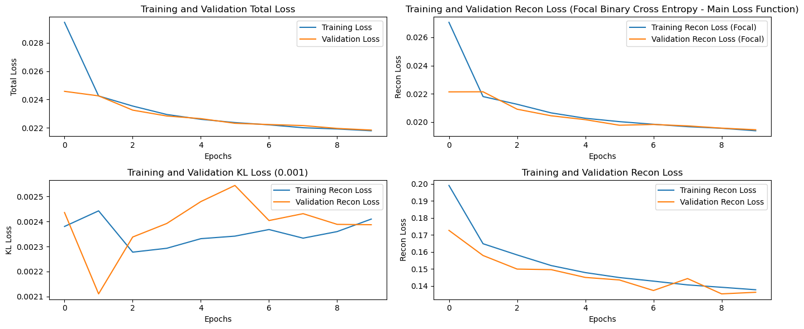

Latent variable distributions:
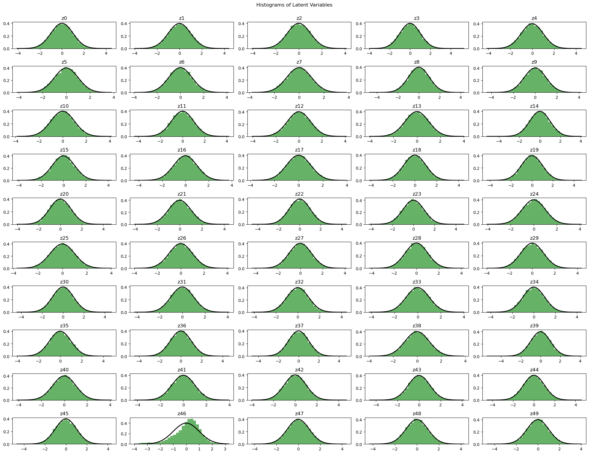

Reconstructions for expression:
[0.49910647 0.44447625 0.51037085 0.4930956  0.49081331 0.47720703
 0.49440914 0.44971117 0.43760142 0.5043862 ]
0.4801177

- now all sit very close to the threshold - at least some are now over 0.5

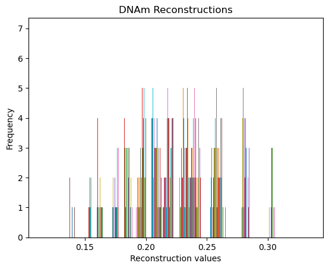
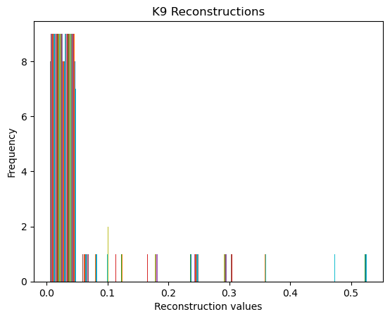
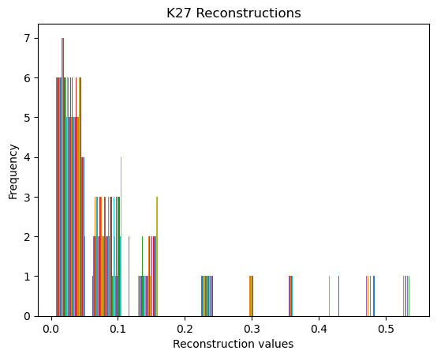
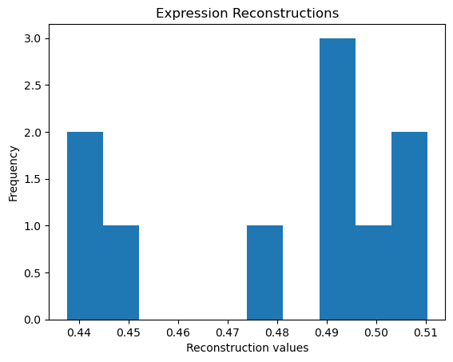


- again, now the values are actually increasing, with some higher values for K27
- normal distribution is still holding despite the weighting on the KL Loss

The histograms of the reconstructions now better align with the actual data


## Investigating changing model architecture: Adding additional Dense Layers

New model:
```
codings_size = 150 # INCREASED FROM 50

# ENCODER
inputs = tf.keras.layers.Input(shape=[12001])
x = tf.keras.layers.Dense(1024, activation="relu")(inputs)  # ADDITIONAL LAYER
x = tf.keras.layers.Dense(512, activation="relu")(x)
x = tf.keras.layers.Dense(256, activation="relu")(x)
codings_mean = tf.keras.layers.Dense(codings_size)(x)  
codings_log_var = tf.keras.layers.Dense(codings_size)(x)  
codings = Sampling()([codings_mean, codings_log_var]) 

# DECODER
decoder_inputs = tf.keras.layers.Input(shape=[codings_size])
x = tf.keras.layers.Dense(256, activation="relu")(decoder_inputs)
x = tf.keras.layers.Dense(512, activation="relu")(x)
x = tf.keras.layers.Dense(1024, activation="relu")(x)  # ADDITIONAL LAYER
x = tf.keras.layers.Dense(12001, activation="sigmoid")(x) 
```

KL Loss over 10 epochs:
[0.00167545 0.00175259 0.00172848 0.00173431 0.00165717 0.0016604
 0.00161783 0.00161041 0.00160082 0.00160063]

 - slight improvement over time, not much

 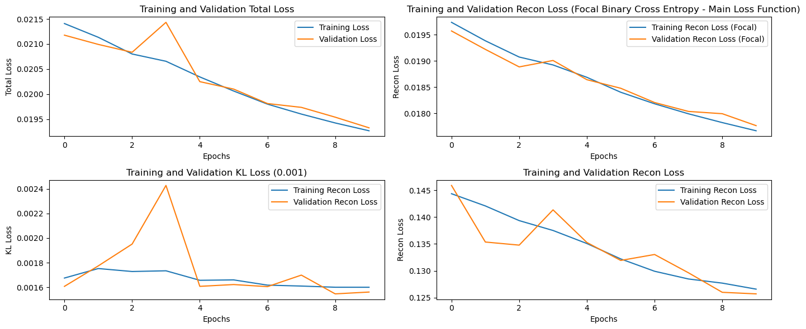

 Reconstructions for expression:
[0.53081936 0.45883572 0.32919207 0.38572136 0.54159045 0.52741873
 0.40975553 0.58720994 0.40381408 0.4097484 ]
mean = 0.4584106

- again, this looks better than it as previously

Reconstruction means for the other features:
- DNAm = 0.03370221588975842
- K9 = 0.032092899370534195
- K27 = 0.010840028496087105


| Feature | Metric | Value | 
| -------- | -------- | -------- |
| Expression | MSE | 0.2125 |
| Expression | Accuracy | 0.7117 |
| Expression | F1 | 0.5697 |
| Expression | Precision | 0.6429 |
| Expression | Recall | 0.5114 |


Tracking the MSE between the summed present modifications and the summed predicted modifications:

| Feature | Metric | Value | 
| -------- | -------- | -------- |
| DNAm | MSE | 28245.1031 |
| K9 | MSE | 363132.0504 |
| K27 | MSE | 38381.5382 |


## Trying the exact same model as above but with a balanced dataset (balanced expression = final value in vectors)

KL Loss over 10 epochs:
[0.00140524 0.00148453 0.00153895 0.00154191 0.0016176  0.00167495
 0.00165581 0.00166695 0.00168606 0.00171511]
 - seems to be increasing slowly - could potentially go back down

 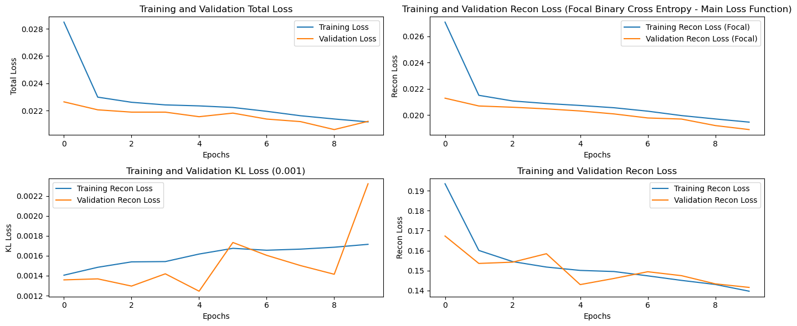


Reconstructions for expression:
 [0.5095502  0.33293393 0.5481488  0.48393354 0.5676774  0.46200612
 0.47746882 0.5262436  0.47929978 0.48984468]
0.4877107


| Feature | Metric | Value | 
| -------- | -------- | -------- |
| Expression | MSE | 0.2327 |
| Expression | Accuracy | 0.6401 |
| Expression | F1 | 0.6007 |
| Expression | Precision | 0.6841 |
| Expression | Recall | 0.5354 |

- better F1, precision and recall scores than unbalanced
- worse MSE and accuracy scores than unbalanced


| Feature | Metric | Value | 
| -------- | -------- | -------- |
| DNAm | MSE | 32793.8320 |
| K9 | MSE | 271742.8228 |
| K27 | MSE | 33429.9730 |

- DNAm is worse than unbalanced
- K9 and K27 are better balanced

We will continue with balanced for now but will experiment with returning to the original dataset when we have a better model. 


### Trying batchnorm and dropout in decoder

```
decoder_inputs = tf.keras.layers.Input(shape=[codings_size])
x = tf.keras.layers.Dense(256, activation="relu")(decoder_inputs)
x = tf.keras.layers.Dense(512, activation="relu")(x)
x = tf.keras.layers.BatchNormalization()(x)
x = tf.keras.layers.Dropout(0.3)(x)  # Dropout to regularise
x = tf.keras.layers.Dense(1024, activation="relu")(x)  # Add another layer (from previous round of testing)
x = tf.keras.layers.BatchNormalization()(x)
x = tf.keras.layers.Dropout(0.3)(x)  # Dropout to regularise
x = tf.keras.layers.Dense(12001, activation="sigmoid")(x)  # Output layer for binary data

```

KL Loss over 10 epochs:
[0.0012669  0.00150334 0.00153078 0.00152725 0.00150993 0.00166877
 0.00178471 0.00179369 0.00176523 0.00176167]
 - increasing over time a little more steadily than before


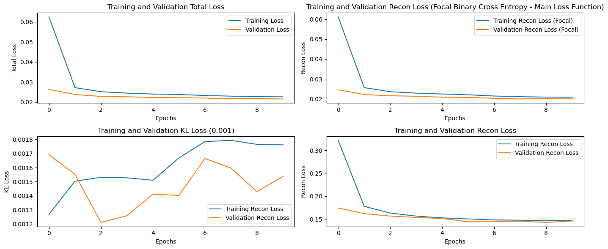

Normal dist looks fine


| Feature | Metric | Value | 
| -------- | -------- | -------- |
| Expression | MSE | 0.2429 |
| Expression | Accuracy | 0.5928 |
| Expression | F1 | 0.6349 |
| Expression | Precision | 0.5806 |
| Expression | Recall | 0.7005 |

- MSE and accuracy decreased
- F1 saw an increase of around 0.07
- precision recall trade-off - recall better but precision poorer


| Feature | Metric | Value | 
| -------- | -------- | -------- |
| DNAm | MSE | 32744.3979 |
| K9 | MSE | 271742.8228 |
| K27 | MSE | 33429.9730 |


- slightly better MSE for DNAm
- same MSE for K9 and K27

### Trying coding_size = 300

KL Loss over 10 epochs:
[0.00168164 0.0015693  0.00158529 0.00147499 0.00143175 0.00146111
 0.00140057 0.00137363 0.00139726 0.00141436]
 - decreases with a slight spike at the end

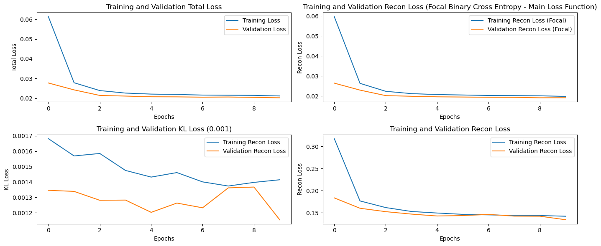

Normal dist looks fine

| Feature | Metric | Value | 
| -------- | -------- | -------- |
| Expression | MSE | 0.2371 |
| Expression | Accuracy | 0.6301 |
| Expression | F1 | 0.6573 |
| Expression | Precision | 0.6181 |
| Expression | Recall | 0.7018 |

- MSE decreased
- accuracy, F1, precision and recall increased

| Feature | Metric | Value | 
| -------- | -------- | -------- |
| DNAm | MSE | 32741.4046 |
| K9 | MSE | 271742.8228 |
| K27 | MSE | 33429.9730 |

- slight drop in DNAm MSE (basically the same)
- no change in K9 or K27 MSE

### Continue
- more complex encoder and decoder
- try conv layers
- try alterate values for coding_size
- try alternate values for KL Loss beta
- learning rate
- optimiser
- return to BCE - any better?

### Increasing coding_size to 400

KL Loss over epochs:
[0.0013084  0.00118914 0.00121452 0.00144882 0.00138598 0.00136506
 0.00137124 0.00138434 0.00135899 0.00136356]

 - seems to stabilise - all still quite low but not basically zero which is good

 Loss curve:

 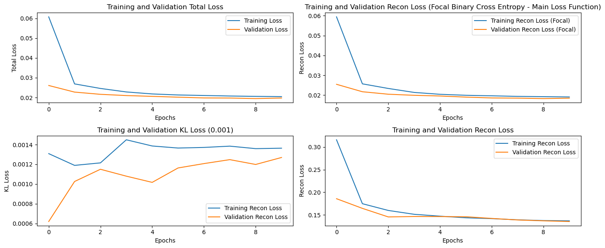


 Normal dist looks fine


| Feature | Metric | Value | 
| -------- | -------- | -------- |
| Expression | MSE | 0.2281 |
| Expression | Accuracy | 0.6629 |
| Expression | F1 | 0.6572 |
| Expression | Precision | 0.6764 |
| Expression | Recall | 0.6390 |

- MSE improved
- accuracy improved
- F1 score basically the same
- precision increased, recall decreased (but more balanced now)


| Feature | Metric | Value | 
| -------- | -------- | -------- |
| DNAm | MSE | 32763.5023 |
| K9 | MSE | 271742.8228 |
| K27 | MSE | 33429.9730 |

- slight increase in DNAm MSE
- exact same MSE for K9 and K27

### Increasing coding_size to 500

KL Loss over epochs:
[0.00130423 0.00123098 0.00135234 0.00133926 0.0013501  0.00138912
 0.0013712  0.00135393 0.00134513 0.00133804]

 - small fluctuations but pretty stable

 Loss curve:

 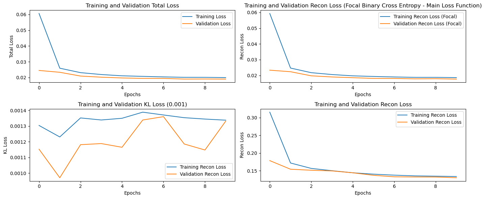


 Normal dist looks fine


| Feature | Metric | Value | 
| -------- | -------- | -------- |
| Expression | MSE | 0.2259 |
| Expression | Accuracy | 0.6685 |
| Expression | F1 | 0.6478 |
| Expression | Precision | 0.6997 |
| Expression | Recall | 0.6031 |


- MSE improved
- accuracy improved
- F1 score slight decrease
- precision increased, recall decreased (but more balanced now)
- precision = predicting TP non-silent, recall = predicting TF silent


| Feature | Metric | Value | 
| -------- | -------- | -------- |
| DNAm | MSE | 32775.4310 |
| K9 | MSE | 271742.8228 |
| K27 | MSE | 33429.9730 |


- slight increase in DNAm MSE
- exact same MSE for K9 and K27

### Retrying coding_size = 300 with different dense layer sizes (making sure hourglass)

KL Loss over 10 epochs:
[0.00162769 0.00149132 0.0015504  0.00154096 0.00158223 0.00158613
 0.00159226 0.00158412 0.00168552 0.00167455]

  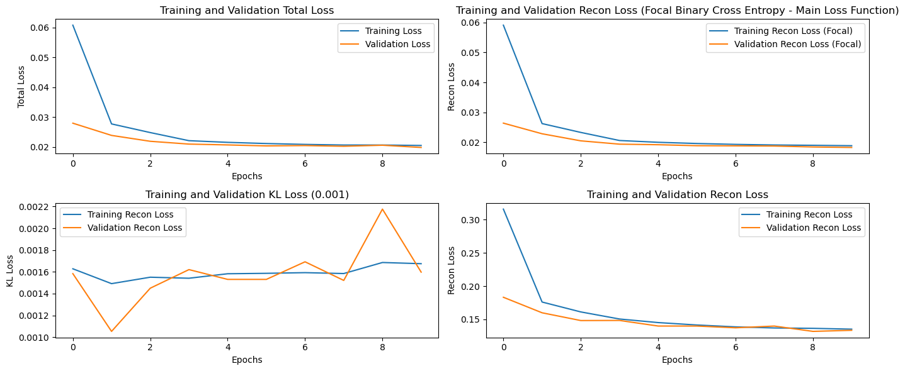

normal dist looks fine

| Feature | Metric | Value | 
| -------- | -------- | -------- |
| Expression | MSE | 0.2282 |
| Expression | Accuracy | 0.6550 |
| Expression | F1 | 0.6621 |
| Expression | Precision | 0.6416 |
| Expression | Recall | 0.6840 |

In comparison to previous 300 model:
- Slight decrease in MSE and increase in accuracy
- increase in F1 and precision, drop in recall

| Feature | Metric | Value | 
| -------- | -------- | -------- |
| DNAm | MSE | 32073.8815 |
| K9 | MSE | 308514.7298 |
| K27 | MSE | 36908.2171 |

- decrease in DNAm MSE
- increase in K9 MSE
- increase in K27 MSE

### Increasing gamma in focal BCE
- default = 2
- Now we will experiment with 2.5 and 3

#### gamma = 2.5
 
 KL Loss over 10 epochs:
 [0.00124704 0.00108017 0.00116678 0.00122229 0.00117587 0.00121687
 0.00120493 0.00117144 0.0012218  0.00121525]
 - stable but no real decrease

Normal dist looks fine

  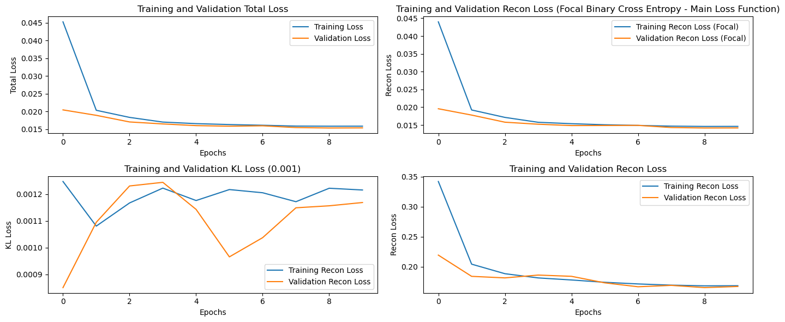


| Feature | Metric | Value | 
| -------- | -------- | -------- |
| Expression | MSE | 0.2308 |
| Expression | Accuracy | 0.6550 |
| Expression | F1 | 0.6393 |
| Expression | Precision | 0.6614 |
| Expression | Recall | 0.6186 |

- slight increase in MSE
- same accuracy
- decreased F1
- increased precision, decreased recall

| Feature | Metric | Value | 
| -------- | -------- | -------- |
| DNAm | MSE | 32094.4308 |
| K9 | MSE | 308514.7298 |
| K27 | MSE | 36908.2171 |

- increase in DNAm MSE
- same K9 MSE
- same K27 MSE

#### gamma = 1.5

KL Loss over 10 epochs:
[0.00222073 0.00192229 0.00197547 0.00172745 0.00179501 0.00179617
 0.0017956  0.00182546 0.00183606 0.00188126]
 - some drop here
 - at least looks like it's learning

 Looks normal

 increased recon loss

  


Expression Accuracy: 0.6642
Expression Mean Squared Error: 0.2190
Expression F1 Score: 0.6730
Expression Precision: 0.6485
Expression Recall: 0.6995

| Feature | Metric | Value | 
| -------- | -------- | -------- |
| Expression | MSE | 0.2190 |
| Expression | Accuracy | 0.6642 |
| Expression | F1 | 0.6730 |
| Expression | Precision | 0.6485 |
| Expression | Recall | 0.6995 |

- decreased MSE
- increased accuracy
- highest F1 score so far
- well balanced precision and recall (both fairly high)

| Feature | Metric | Value | 
| -------- | -------- | -------- |
| DNAm | MSE |  32067.6290 |
| K9 | MSE | 308514.7298 |
| K27 | MSE | 36908.2171 |

- slight decrease in DNAm MSE
- same K9 and K27

#### gamma = 1

KL Loss over 10 epochs:
[0.00298465 0.00225089 0.00238821 0.00250591 0.00227895 0.00228662
 0.00226332 0.00232594 0.00227912 0.00230542]

- a little bit of learning
- higher KL Loss than usual

Expression Accuracy: 0.6769
Expression Mean Squared Error: 0.2125
Expression F1 Score: 0.6631
Expression Precision: 0.6840
Expression Recall: 0.6435

| Feature | Metric | Value | 
| -------- | -------- | -------- |
| Expression | MSE | 0.2125 |
| Expression | Accuracy | 0.6769 |
| Expression | F1 | 0.6631 |
| Expression | Precision | 0.6840 |
| Expression | Recall | 0.6435 |

- slightly lower MSE
- higher accuracy
- lower in F1
- higher precision, lower recall


| Feature | Metric | Value | 
| -------- | -------- | -------- |
| DNAm | MSE |  32084.9578 |
| K9 | MSE | 308514.7298 |
| K27 | MSE | 36908.2171 |

- higher DNAm MSE
- same for K9 and K27

### Introducing ReduceLROnPateau
- as seen in the loss curve plots, the loss plateaus quite early on. We will introduce a ReduceLROnPlateau LR schedule to see if this improves our results


#### Increasing encoder, decoder complexity
- addig an additional Dense layer to encoder and decoder
- testing with coding size = 300 and gamma = 2

```
# # ENCODER
inputs = tf.keras.layers.Input(shape=[12001])
x = tf.keras.layers.Dense(1284, activation="relu")(inputs)  # Increase size
x = tf.keras.layers.Dense(1024, activation="relu")(x)  # Increase size
x = tf.keras.layers.Dense(768, activation="relu")(x) # changing layer sizes
x = tf.keras.layers.Dense(512, activation="relu")(x)
#x = tf.keras.layers.Dense(256, activation="relu")(x)
codings_mean = tf.keras.layers.Dense(codings_size)(x)  # mean
codings_log_var = tf.keras.layers.Dense(codings_size)(x)  # log_var
codings = Sampling()([codings_mean, codings_log_var])  # KL Loss added here


# KL Divergence Layer
# codings_mean, codings_log_var = KLDivergenceLayer()([codings_mean, codings_log_var])

# define VAE
variational_encoder = tf.keras.Model(
    inputs=[inputs], outputs=[codings_mean, codings_log_var, codings]
)

# DECODER
decoder_inputs = tf.keras.layers.Input(shape=[codings_size])
#x = tf.keras.layers.Dense(256, activation="relu")(decoder_inputs)
x = tf.keras.layers.Dense(512, activation="relu")(decoder_inputs)
x = tf.keras.layers.Dense(768, activation="relu")(x)
x = tf.keras.layers.BatchNormalization()(x)
x = tf.keras.layers.Dropout(0.3)(x)  # Dropout to regularize
x = tf.keras.layers.Dense(1024, activation="relu")(x)  # Add another layer
x = tf.keras.layers.BatchNormalization()(x)
x = tf.keras.layers.Dropout(0.3)(x)  # Dropout to regularize
x = tf.keras.layers.Dense(1280, activation="relu")(x)  # Add another layer
x = tf.keras.layers.Dense(12001, activation="sigmoid")(x)  # Output layer for binary data


```

KL Loss over 10 epochs:
[0.00129749 0.00126446 0.00123436 0.0013146  0.00116307 0.00117443
 0.00120009 0.00123029 0.00122024 0.00121937]
 - decrease then increase

| Feature | Metric | Value | 
| -------- | -------- | -------- |
| Expression | MSE | 0.2256 |
| Expression | Accuracy | 0.6775 |
| Expression | F1 | 0.6463 |
| Expression | Precision | 0.7055 |
| Expression | Recall | 0.5962 |

- Compare against previous coding_size = 300 with gamma = 2
- increase accuracy
- decrease MSE
- decrease F1
- increase precision decrease recall


| Feature | Metric | Value | 
| -------- | -------- | -------- |
| DNAm | MSE | 32100.5289 |
| K9 | MSE | 308514.7298 |
| K27 | MSE | 36908.2171 |

- Compare against previous coding_size = 300 with gamma = 2
- increase in DNA MSE
- same MSE K9 and K27

### Trying to remove batch norm and dropout

KL Loss over 10 epochs
[0.00104523 0.00112221 0.00115311 0.00123499 0.00124495 0.00116499
 0.00118429 0.00120572 0.00118677 0.0011794 ]

 - similar the whole time


| Feature | Metric | Value | 
| -------- | -------- | -------- |
| Expression | MSE | 0.2232 |
| Expression | Accuracy | 0.6544 |
| Expression | F1 | 0.6831 |
| Expression | Precision | 0.6245 |
| Expression | Recall | 0.7539 |

- decrease in MSE
- decrease in accuracy
- highest F1 score thus far
- lower precision, high recall


For remaining sections
COUNTS:
| Feature | Metric | Value | 
| -------- | -------- | -------- |
| DNAm | MSE | 32062.2544 |
| K9 | MSE | 308514.7298 |
| K27 | MSE | 36908.2171 |

- slight decrease in DNAm MSE count


OUTPUT:
| Feature | Metric | Value | 
| -------- | -------- | -------- |
| DNAm | MSE | 0.0694 |
| K9 | MSE | 0.0103 |
| K27 | MSE | 0.0131 |

### Adding another Dense layer (1563)

```
# # ENCODER
inputs = tf.keras.layers.Input(shape=[12001])
x = tf.keras.layers.Dense(1536, activation="relu")(inputs)  # Increase size
x = tf.keras.layers.Dense(1280, activation="relu")(x)  # Increase size
x = tf.keras.layers.Dense(1024, activation="relu")(x)  # Increase size
x = tf.keras.layers.Dense(768, activation="relu")(x) # changing layer sizes
x = tf.keras.layers.Dense(512, activation="relu")(x)
#x = tf.keras.layers.Dense(256, activation="relu")(x)
codings_mean = tf.keras.layers.Dense(codings_size)(x)  # mean
codings_log_var = tf.keras.layers.Dense(codings_size)(x)  # log_var
codings = Sampling()([codings_mean, codings_log_var])  # KL Loss added here


# KL Divergence Layer
# codings_mean, codings_log_var = KLDivergenceLayer()([codings_mean, codings_log_var])

# define VAE
variational_encoder = tf.keras.Model(
    inputs=[inputs], outputs=[codings_mean, codings_log_var, codings]
)

# DECODER
decoder_inputs = tf.keras.layers.Input(shape=[codings_size])
#x = tf.keras.layers.Dense(256, activation="relu")(decoder_inputs)
x = tf.keras.layers.Dense(512, activation="relu")(decoder_inputs)
x = tf.keras.layers.Dense(768, activation="relu")(x)
#x = tf.keras.layers.BatchNormalization()(x)
#x = tf.keras.layers.Dropout(0.3)(x)  # Dropout to regularize
x = tf.keras.layers.Dense(1024, activation="relu")(x)  # Add another layer
#x = tf.keras.layers.BatchNormalization()(x)
#x = tf.keras.layers.Dropout(0.3)(x)  # Dropout to regularize
x = tf.keras.layers.Dense(1280, activation="relu")(x)  # Add another layer
x = tf.keras.layers.Dense(1536, activation="relu")(x)  # Add another layer
x = tf.keras.layers.Dense(12001, activation="sigmoid")(x)  # Output layer for binary data
```


KL Loss over 10 epochs
[0.00102267 0.00110254 0.00114843 0.00111509 0.0012218  0.00116046
 0.00114288 0.0011435  0.00118431 0.00113488]
 - seems to be growing a bit

Normal dist looks fine


| Feature | Metric | Value | 
| -------- | -------- | -------- |
| Expression | MSE | 0.2214 |
| Expression | Accuracy | 0.6808 |
| Expression | F1 | 0.6700 |
| Expression | Precision | 0.6848 |
| Expression | Recall | 0.6559 |

- accuracy increased and MSE decreased
- F1 decreased
- recall decreased, prceision increased

For remaining sections
COUNTS:
| Feature | Metric | Value | 
| -------- | -------- | -------- |
| DNAm | MSE | 32087.8255 |
| K9 | MSE | 308514.7298 |
| K27 | MSE | 36908.2171 |

- slight increase in DNAm MSE count


OUTPUT:
| Feature | Metric | Value | 
| -------- | -------- | -------- |
| DNAm | MSE | 0.0731 |
| K9 | MSE | 0.0127 |
| K27 | MSE | 0.0138 |

- increase in MSE for all sections

Therefore, the previous version was better

### Returning to an imbalanced dataset (and one less dense - no 1536)

KL Loss
[0.00119362 0.00123642 0.00129527 0.00127598 0.00129576 0.00121744
 0.00125996 0.00120955 0.00124193 0.00123405]
 - stable whole time

 - better at predicting non-expression values (DNAm, K9, K27) but worse at predicting expression

looks normal

EXPRESSION
Expression Accuracy: 0.7345
Expression Mean Squared Error: 0.2098
Expression F1 Score: 0.6039
Expression Precision: 0.6914
Expression Recall: 0.5360

COUNT
MSE for DNAm section: 28238.6744
MSE for K9 section: 363132.0504
MSE for K27 section: 38381.5382

OUTPUT
MSE for DNAm section: 0.0671
MSE for K9 section: 0.0108
MSE for K27 section: 0.0119

### Experimenting with adding alpha to the loss function (alpha = 0.75)
- given that there is an average of 307.68 1s in the train dataset / 12001 values in the input vector, we will start with a higher alpha value of 0.75, then try a 0.9 and a 0.5

KL Loss over 10 epochs

[0.00117785 0.00121291 0.0012545  0.00131126 0.0013218  0.00135368
 0.00127647 0.00126978 0.00125456 0.001226  ]


Expression Accuracy: 0.7277
Expression Mean Squared Error: 0.2157
Expression F1 Score: 0.5853
Expression Precision: 0.6778
Expression Recall: 0.5150


MSE for DNAm section: 28242.9895
MSE for K9 section: 363132.0504
MSE for K27 section: 38381.5382

MSE for DNAm section: 0.0628
MSE for K9 section: 0.0103
MSE for K27 section: 0.0127

** worse - will try a lower alpha

### alpha = 0.25

KL LOss
[0.00118159 0.00120053 0.00135695 0.00123002 0.0012583  0.00125431
 0.00124509 0.00131879 0.00137661 0.00140101]
 - increasing over time


Expression Accuracy: 0.7144
Expression Mean Squared Error: 0.2145
Expression F1 Score: 0.5355
Expression Precision: 0.6811
Expression Recall: 0.4412


MSE for DNAm section: 28262.2724
MSE for K9 section: 363132.0504
MSE for K27 section: 38381.5382

MSE for DNAm section: 0.0653
MSE for K9 section: 0.0108
MSE for K27 section: 0.0124

### alpha = 0.9
- previously, KL beta = 0.001

KL Loss
[0.00112754 0.00118575 0.00130388 0.00128487 0.00119975 0.00133816
 0.00135461 0.00124251 0.00131768 0.00132422]
 - around the same level

Expression Accuracy: 0.7238
Expression Mean Squared Error: 0.2104
Expression F1 Score: 0.5758
Expression Precision: 0.6742
Expression Recall: 0.5025


MSE for DNAm section: 28247.7275
MSE for K9 section: 363132.0504
MSE for K27 section: 38381.5382

MSE for DNAm section: 0.0668
MSE for K9 section: 0.0105
MSE for K27 section: 0.0129

might be slightly worse

### KL Weighting = 0.0001
- balanced, 300, alpha=0.25, gamma=2.0

```
codings_size = 300

inputs = tf.keras.layers.Input(shape=[12001])
x = tf.keras.layers.Dense(1280, activation="relu")(inputs)  # Increase size
x = tf.keras.layers.Dense(1024, activation="relu")(x)  # Increase size
x = tf.keras.layers.Dense(768, activation="relu")(x) # changing layer sizes
x = tf.keras.layers.Dense(512, activation="relu")(x)
codings_mean = tf.keras.layers.Dense(codings_size)(x)  # mean
codings_log_var = tf.keras.layers.Dense(codings_size)(x)  # log_var
codings = Sampling()([codings_mean, codings_log_var])  # KL Loss added here

decoder_inputs = tf.keras.layers.Input(shape=[codings_size])
x = tf.keras.layers.Dense(512, activation="relu")(decoder_inputs)
x = tf.keras.layers.Dense(768, activation="relu")(x)
x = tf.keras.layers.Dense(1024, activation="relu")(x)  # Add another layer
x = tf.keras.layers.Dense(1280, activation="relu")(x)  # Add another layer
x = tf.keras.layers.Dense(12001, activation="sigmoid")(x)  # Output layer for binary data

```

KL Loss
[0.00043765 0.00039846 0.00045231 0.00050622 0.00047957 0.00047795
 0.00048858 0.00047208 0.00049289 0.00050519]
 - even lower despite decreasing its importance?

Recon loss looks quite low


Expression Accuracy: 0.7280
Expression Mean Squared Error: 0.2077
Expression F1 Score: 0.6862
Expression Precision: 0.8150
Expression Recall: 0.5926

MSE for DNAm section: 31859.1357
MSE for K9 section: 262771.3624
MSE for K27 section: 35124.8199

MSE for DNAm section: 0.0646
MSE for K9 section: 0.0066
MSE for K27 section: 0.0073

- lowest loss so far
- best model
- doesn't need to be so constrained since it already follows a normal dist


### KL Weighting = 0.01

KL Loss
[0.00191597 0.00233753 0.00263926 0.00267881 0.00267605 0.00260244
 0.00267198 0.00269688 0.00263559 0.00265283]
 - higher when constraining more??
 - need to check implementation

 Expression Accuracy: 0.5315
Expression Mean Squared Error: 0.2467
Expression F1 Score: 0.6415
Expression Precision: 0.5208
Expression Recall: 0.8351

MSE for DNAm section: 31800.9810
MSE for K9 section: 262771.3624
MSE for K27 section: 35124.8199

MSE for DNAm section: 0.0714
MSE for K9 section: 0.0186
MSE for K27 section: 0.0203

- has a harder time recreating this

***Comparing against KL loss implementation***
Previous:
```
  kl_loss = -0.5 * tf.reduce_mean(
      1 + log_var - tf.exp(log_var) - tf.square(mean),
      axis=-1,
  )
  self.add_loss(kl_loss * 0.01)
  return tf.random.normal(tf.shape(log_var)) * tf.exp(log_var / 2) + mean
```
Current:
```
  kl_loss = -0.5 * tf.reduce_sum(
      1 + log_var - tf.exp(log_var) - tf.square(mean),
      axis=-1,
  )
  self.add_loss(tf.reduce_mean(kl_loss * 0.01))
  return tf.random.normal(tf.shape(log_var)) * tf.exp(log_var / 2) + mean
```


### Would be good to try a tuner on coding size, gamma [1.5, 2], alpha[0.25, 0.75], balanced v original