# Variational Autoencoder (VAE) Results

### Model Loss Summary - follows the Hands On Machine Learning implementation (Geron, 2022) with additional logic for masking
1. Random Masking Layer

    This layer randomly selects one of the four features (DNA methylation, H3K9me3, H3K27me3, or gene expression) and applies a mask to it (-1).
    The resulting masked input (a 12001 binary vector with a masked section using -1) is then passed through the VAE.

2. KL Divergence Loss

    The KLDivergenceLayer computes how much the learned latent distribution (represented by codings_mean and codings_log_var) diverges from the standard normal distribution (which serves as a prior).
    The loss is normalised by the number of features (12001) to ensure that the scale is appropriate.

3. Custom Loss Layer

    This layer calculates the reconstruction loss specifically for the masked sections.
    Masking Logic: The model first identifies indices that were masked (i.e. where the input was set to -1.0).
    Binary Cross-Entropy Loss: The reconstruction loss is computed using binary cross-entropy since the data is binary.
        The binary cross-entropy loss is calculated between the original inputs and the reconstructed outputs.
        The reconstructed outputs are clipped to avoid issues with taking the log of zero or negative numbers, which could lead to numerical instability.
    Masked Loss: The loss is then focused only on the masked indices by multiplying the loss with the mask indices.
    Averaging and Avoiding Division by Zero:
        The loss is averaged over the masked indices to compute a per-sample loss.

### Baseline model: Using all features (and all data) as input without masking
(481647)
Start with a baseline - use all data to input and regenerate 12001 input (4000 DNAm, 4000 K9, 4000 K27, 1 Expression)

`codings_size = 50`

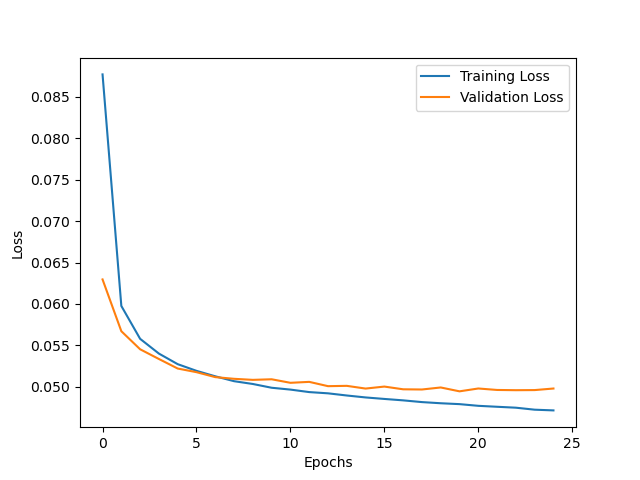

Notes:
- Not entirely confident how to interpret this - assuming this is good since 0 is perfect and 1 would be random(?)

### Split expression model: Splitting the data into two groups (silent and non-silent) as input without masking

#### Version 1: Training 2 models separately
(481698)

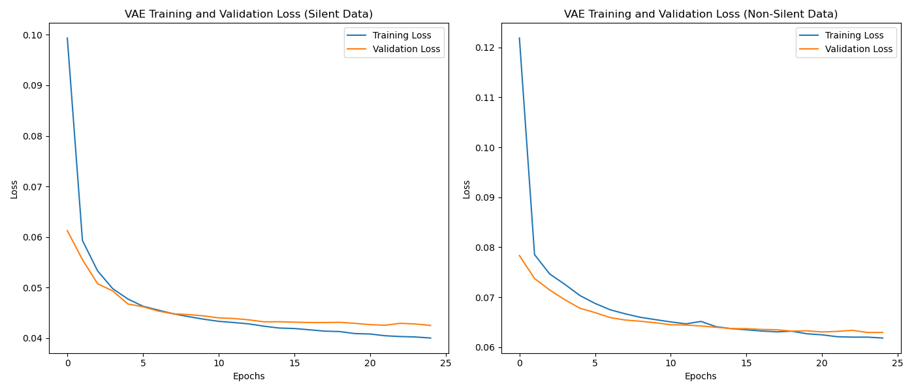

Notes:
- Silent class is easier to regenerate than non-silent (more variance in this class)
- Separating the two gives the lowest reconstruction yet for the silent class
- This makes sense that it would be harder to regenerate the non-silent class as it represents all expression values except for 0 (thus more variation)

#### Version 2: Training 1 model (same as baseline model) and validating classes separately
(485904)

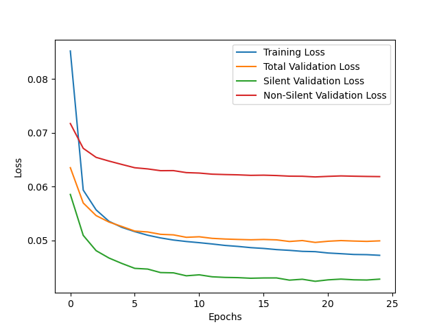

Notes:
- Supports previous findings - silent is easier to recreate (which aligns with the logic that silent has less variation, due to 'zero vs non-zero' nature)

### Random Masking model: using all features (and all data) as input with randomly masked subsections
(482584)
This model utilises a random masking function which randomly selects a feature subset for each minibatch and validation set and masks this whole feature as -1. It then finds the loss of the masked section - so the below plot represents the error of regenrating the masked section. 

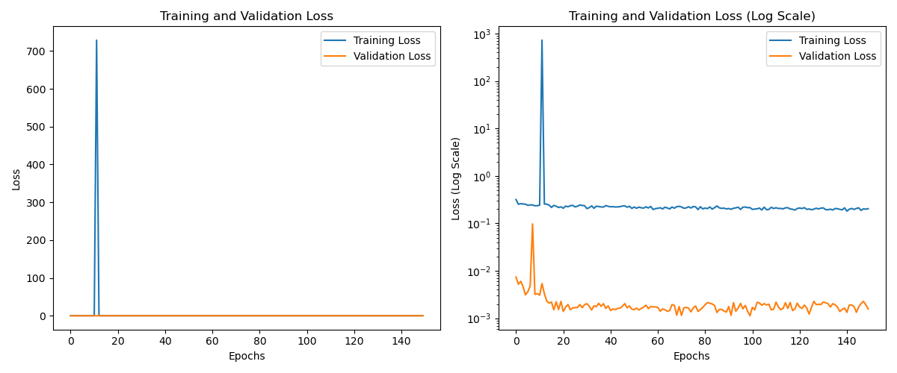

Notes:
- When running this model, noticed consistent spikes early on - hence I have added the log scale to better see the lower error rates
- My best guess is that because we randomly mask sections, the model doesn't follow the typical loss corve (slowly decreasing over time). At some point, it makes a large error
- The large error in this sample occurs at epoch 12 where subset 1 (K9) increased error from <1 to >30, which continued to increase to >740 (likely due to introducing instability) until epoch 13 where it resets
- Final epoch settling around loss: 0.2072 and val_loss: 0.0016
- Why might val loss be so much lower than train loss? Is it because of the regularisation introduced by KLDivergence

To better understand this model, we now report whole loss and masked loss to see how the model progresses:

INSERT PLOT

### Fixed Masking models: using all features but training the model whilst masking only one section throughout training and validation

Initially, this was separated out into individual models to better understand the spikes and components that the Random Masking model is required to learn.

To further investigate the reconstrcution of individual components (in particular, K9 and K27, which we currently are unsure whether the model is predicting well or just predicting zero the whole time), we separate loss into KL Loss and reconstrcution loss. This will show whether the loss is derviced from the guassians or reconstruction. 

In VAE, total loss is composed of two components:
1. Reconstruction loss: How well the model can reconstruct the data from the latent space. It ensures the decoder output is close to the original input. 
2. KL Divergence Loss: How much the learned latent distribution deviates from a normal Guassian distribution - this regularises the latent space by encouraging encoded variables to follow Guassian distribution. 

What does this show:
1. Reconstruction loss: if low, the model can recreate the input well but if too low, may indicate overfitting and poor generalisation
2. KL Loss: if low, then the model is learning a smooth latent space close to Guassian, but very low loss might indicate underfitting.

Plotting both allows us to track the trade-off between regularisation and accuracy.

Implications for sparse K9 and K27:
- To ensure the model isn't taking advantage of the fact that the dataset is comprised of mostly zeros, we can check KL loss
- If KL loss is very low, this would indicate the model isn't learning the data distribution and just using Guassian distribution   
- Reconstruction loss will likely be low regardless of the models predictive ability due to the data's sparsity
- If both are low, then liekly the model is underfitting (predicting zeros too often)

KL loss is universal to the whole input, whilst reconstruction loss can be specific to the masked input section. As such, we will track:
- masked total loss
- whole input total loss
- masked reconstruction loss
- whole input reconstruction loss
- KL loss

#### Masking DNAm
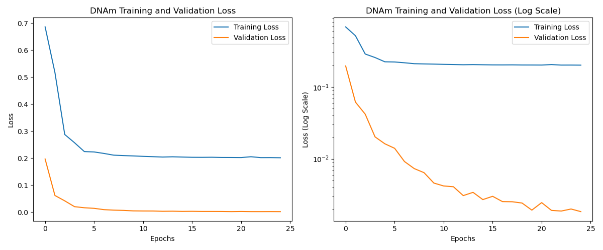

#### Masking K9
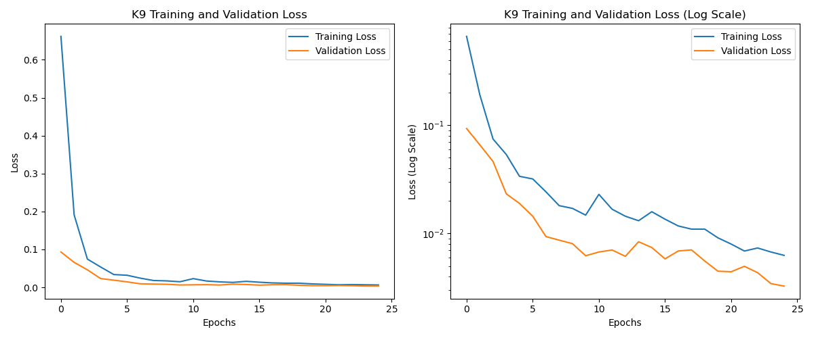

#### Masking K27
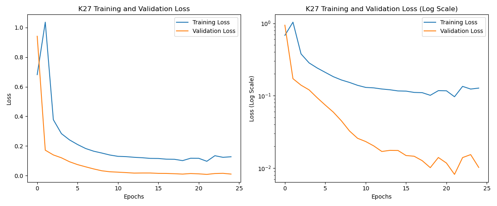

#### Masking Expression
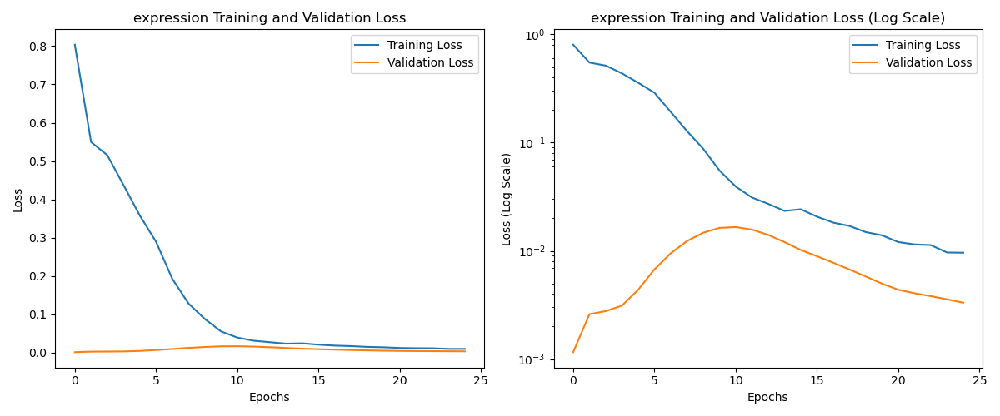

Notes: 
- All categories when masking consistently throughout training decrease gradually over time (without sudden spikes as seen in the random masking model)
- How can I compare this to a baseline? How can I assess success? 
- Final val loss for all the above models: 

| Model | Val BCE |
| ------------- | ------------- |
| DNAm | 0.0031 |
| K9 | 0033 |
| K27 | 0.0102 |
| Expression | 0.0033 |
(482585, 482586, 482587, 482589)

- Expression, DNAm, K9 all have similar loss whilst K27 has a slightly higher loss

### Loss breakdowns (fixed feature masking) - coding_size=50

- Note that loss is averaged over the inputs (so masked loss may be higher than total loss if it is harder to predict)
- KL Loss is the same for total and whole as it is used in the latent space which doesn't align with a specific portion of the input

NOTE: 3rd train vs Loss plot - Val = RED, Train = GREEN
#### DNAm

(486327)

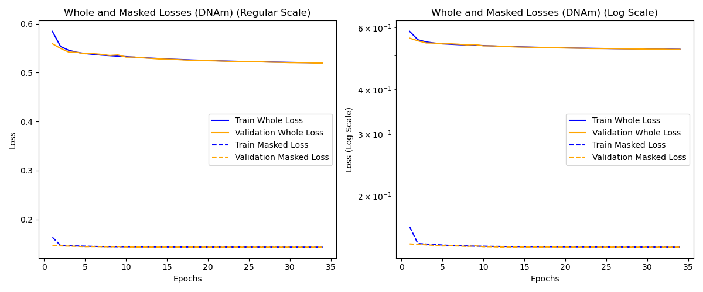
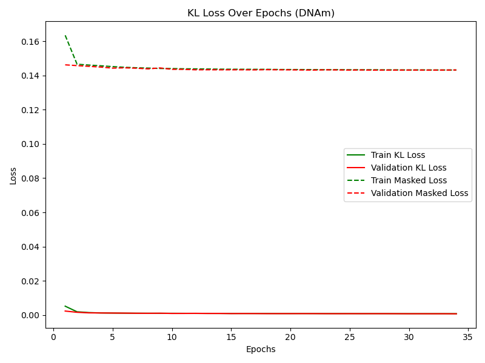

#### K9

(486328)

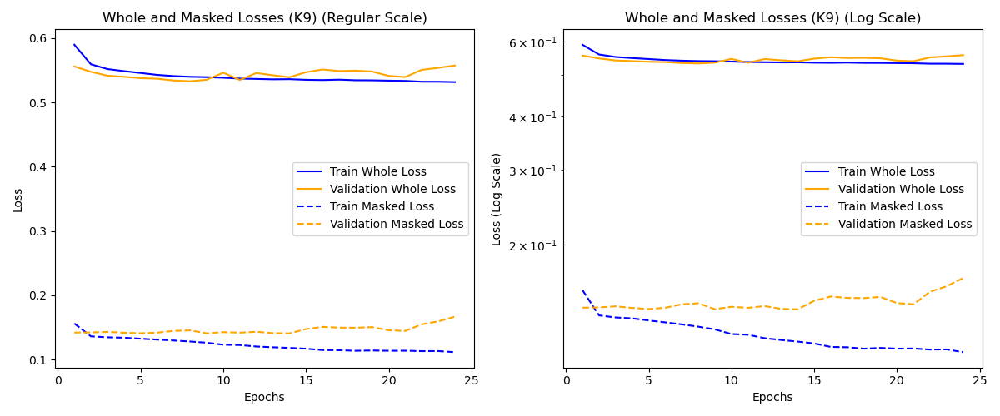
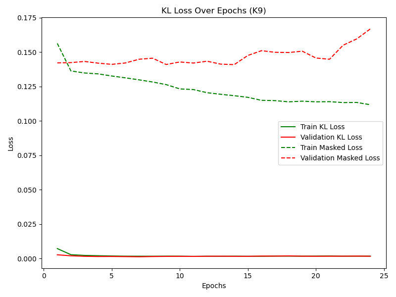

#### K27

(486329)

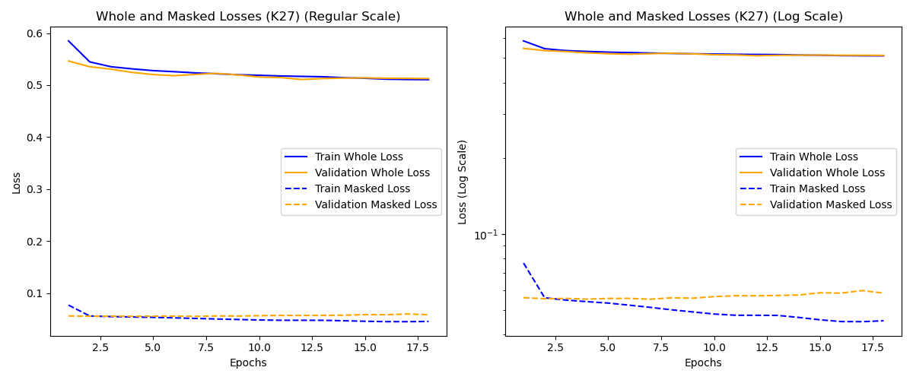
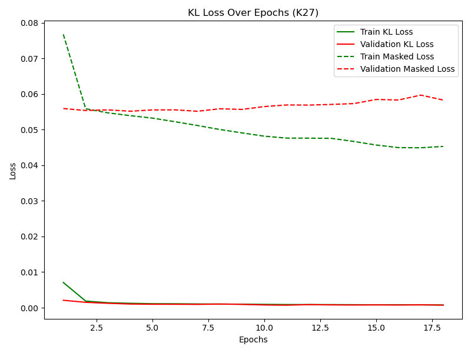

#### Expression

(486330)

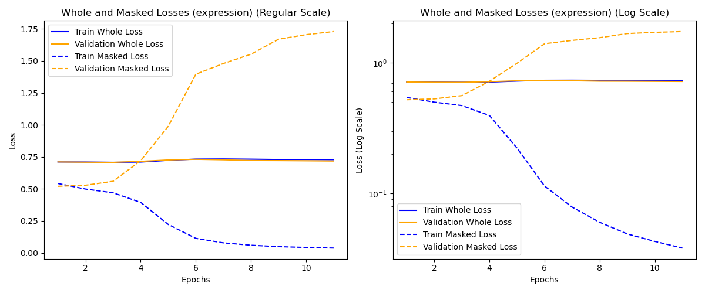
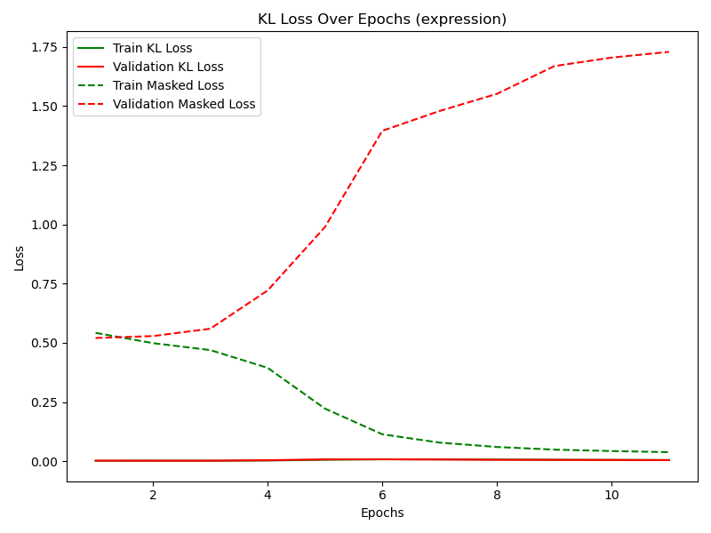

^^ Realised I am not plotting total training and validation loss which makes it hard to see how the model is performing. Additionally, I realised my coding size / latent dimension is likely quite constricting given my input size of 12001. I will change this from 50 to 300 and repeat the above studies. 

### Loss breakdowns (fixed feature masking) [coding_size=300]

#### DNAm
![VAE Fixed Mask DNAm [coding_size=300] (Loss Breakdown)](coding_size300/vae_allcat_mask_vs_whole_loss_DNAm_v3.png)
![VAE Fixed Mask DNAm [coding_size=300] (KL Breakdown)](coding_size300/kl_loss_plot_DNAm_v3.png)
![VAE Fixed Mask DNAm [coding_size=300] (Loss)](coding_size300/train_vs_val_loss_DNAm_v3.png)

#### K9
![VAE Fixed Mask K9 [coding_size=300] (Loss Breakdown)](coding_size300/vae_allcat_mask_vs_whole_loss_K9_v3.png)
![VAE Fixed Mask K9 [coding_size=300] (KL Breakdown)](coding_size300/kl_loss_plot_K9_v3.png)
![VAE Fixed Mask K9 [coding_size=300] (Loss)](coding_size300/train_vs_val_loss_K9_v3.png)

#### K27
![VAE Fixed Mask K27 [coding_size=300] (Loss Breakdown)](coding_size300/vae_allcat_mask_vs_whole_loss_K27_v3.png)
![VAE Fixed Mask K27 [coding_size=300] (KL Breakdown)](coding_size300/kl_loss_plot_K27_v3.png)
![VAE Fixed Mask K27 [coding_size=300] (Loss)](coding_size300/train_vs_val_loss_K27_v3.png)

#### Expression
![VAE Fixed Mask Expression [coding_size=300] (Loss Breakdown)](coding_size300/vae_allcat_mask_vs_whole_loss_expression_v3.png)
![VAE Fixed Mask Expression [coding_size=300] (KL Breakdown)](coding_size300/kl_loss_plot_expression_v3.png)
![VAE Fixed Mask Expression [coding_size=300] (Loss)](coding_size300/train_vs_val_loss_expression_v3.png)

Notes: 
- 

### Loss breakdowns (fixed feature masking) [coding_size=300] with balanced expression dataset

#### DNAm
![VAE Fixed Mask DNAm [coding_size=300] & Balanced expression (Loss Breakdown)](coding_size300/balanced/vae_allcat_mask_vs_whole_loss_DNAm_balanced_v3.png)
![VAE Fixed Mask DNAm [coding_size=300] & Balanced expression (KL Breakdown)](coding_size300/balanced/kl_loss_plot_DNAm_balanced_v3.png)
![VAE Fixed Mask DNAm [coding_size=300] & Balanced expression (Loss)](coding_size300/balanced/train_vs_val_loss_DNAm_balanced_v3.png)

#### K9
![VAE Fixed Mask K9 [coding_size=300] & Balanced expression (Loss Breakdown)](coding_size300/balanced/vae_allcat_mask_vs_whole_loss_K9_balanced_v3.png)
![VAE Fixed Mask K9 [coding_size=300] & Balanced expression (KL Breakdown)](coding_size300/balanced/kl_loss_plot_K9_balanced_v3.png)
![VAE Fixed Mask K9 [coding_size=300] & Balanced expression (Loss)](coding_size300/balanced/train_vs_val_loss_K9_balanced_v3.png)

#### K27
![VAE Fixed Mask K27 [coding_size=300] & Balanced expression (Loss Breakdown)](coding_size300/balanced/vae_allcat_mask_vs_whole_loss_K27_balanced_v3.png)
![VAE Fixed Mask K27 [coding_size=300] & Balanced expression (KL Breakdown)](coding_size300/balanced/kl_loss_plot_K27_balanced_v3.png)
![VAE Fixed Mask K27 [coding_size=300] & Balanced expression (Loss)](coding_size300/balanced/train_vs_val_loss_K27_balanced_v3.png)

#### Expression
![VAE Fixed Mask Expression [coding_size=300] & Balanced expression (Loss Breakdown)](coding_size300/balanced/vae_allcat_mask_vs_whole_loss_expression_balanced_v3.png)
![VAE Fixed Mask Expression [coding_size=300] & Balanced expression (KL Breakdown)](coding_size300/balanced/kl_loss_plot_expression_balanced_v3.png)
![VAE Fixed Mask Expression [coding_size=300] & Balanced expression (Loss)](coding_size300/balanced/train_vs_val_loss_expression_balanced_v3.png)

